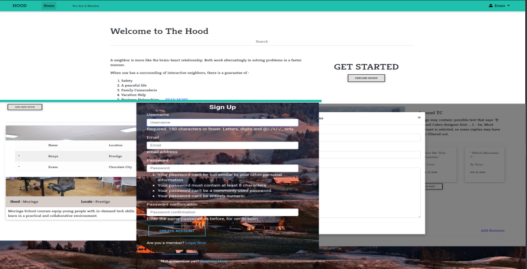

# Hood
A Django generated web application that allows users to be in the loop about everything happening in their neighborhood. From contact information of different handyman to meeting announcements or even alerts

## Author
* Evans Nyambane


### Hood



## BDD
* Display project:

    - Neighbourhoods

    - Neighbors

    - Businesses

* Add posts
* Update profile


## Input
* Submit hood
* Click to join or leave hood
* Click to view joined hood
* Add post & business
* Click to view neighbors
* Update profile


## Output
* Neighbourhood(s)
* Hood details
* Post & business added
* Profile updated

  
## Setup and Installation   
In setting up this application, you'll mostly work with your bash

 Cloning the repository:  
 ```
  $ git clone https://github.com/DjCooGie/Hood.git
```
 Navigate into the folder
 ```
  $ cd Hood/
```
 Install requirements  
 ```
  $ pip install -r requirements.txt 
```
 Install and activate Virtual  
 ```
  $ python3.6 -m venv virtual - source virtual/bin/activate  
```  
Install Dependencies  
 ```
   $ pip install -r requirements.txt 
```  
 
 *** SetUp your database
 ```
 $ python3.6 manage.py makemigrations hood 
 ``` 
 $ python3.6 manage.py migrate 
```
Run the application  
 ```
 $ python3.6 manage.py runserver 
``` 
Testing the application  
 ```
 $ python3.6 manage.py test hood
```
 Running the application  
 ```
 $ python3.6 manage.py runserver 
```
  
## Technologies Used
  * [Python version 3.8.9](https://www.python.org/) . 
  * [Django (django modules)](https://docs.djangoproject.com/en/3.0/intro/tutorial01/).
  * PSQL database.
  * Javascript (jQuery)
  * Google Fonts & Icons
  * MDB Bootstrap
  
  
#### Bugs
The profile page, add business and edit profile functionalities are under development.

## Site Live Link
[https://evan-hood-ups.herokuapp.com/](https://evan-hood-ups.herokuapp.com/)


#### Collaborate
>Incase of any questions, problems or ideas concerning the app, feel free to reach out to me:
>>Github: [Evans Nyambane](https://github.com/DjCooGie)
>>Email: evansonchagwa01@gmail.com

#### License
MIT
&copy;2020 Evans Nyambane


Permission is hereby granted, free of charge, to any person obtaining a copy
of this software and associated documentation files (the "Software"), to deal
in the Software without restriction, including without limitation the rights
to use, copy, modify, merge, publish, distribute, sublicense, and/or sell
copies of the Software, and to permit persons to whom the Software is
furnished to do so, subject to the following conditions:
The above copyright notice and this permission notice shall be included in all
copies or substantial portions of the Software.
THE SOFTWARE IS PROVIDED "AS IS", WITHOUT WARRANTY OF ANY KIND, EXPRESS OR
IMPLIED, INCLUDING BUT NOT LIMITED TO THE WARRANTIES OF MERCHANTABILITY,
FITNESS FOR A PARTICULAR PURPOSE AND NONINFRINGEMENT. IN NO EVENT SHALL THE
AUTHORS OR COPYRIGHT HOLDERS BE LIABLE FOR ANY CLAIM, DAMAGES OR OTHER
LIABILITY, WHETHER IN AN ACTION OF CONTRACT, TORT OR OTHERWISE, ARISING FROM,
OUT OF OR IN CONNECTION WITH THE SOFTWARE OR THE USE OR OTHER DEALINGS IN THE
SOFTWARE.

